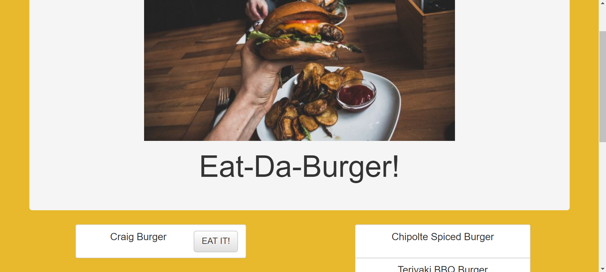

# Eat the Burger

## Node Express-Handlebars

### Overview

This is a burger logger application using MySQL, Node, Express, Handlebars and a ORM.

### Before You Begin

* Eat the Burger is a restaurant app that lets users input the names of burgers they'd like to eat.

* Whenever a user submits a burger's name, your app will display the burger on the left side of the page -- waiting to be devoured.

* Each burger in the waiting area also has a `Devour it!` button. When the user clicks it, the burger will move to the right side of the page.

* The app will store every burger in a database, whether devoured or not.

#### App Setup

1. Make a package.json file by running `npm init` from the command line.

2. Install the Express npm package: `npm install express`.

4. Install the Handlebars npm package: `npm install express-handlebars`.

5. Install the body-parser npm package: `npm install body-parser`.

6. Install MySQL npm package: `npm install mysql`.

7. Install method-override package: 'npm install method-override'

#### Photo by Tristan Gassert on Unsplash
